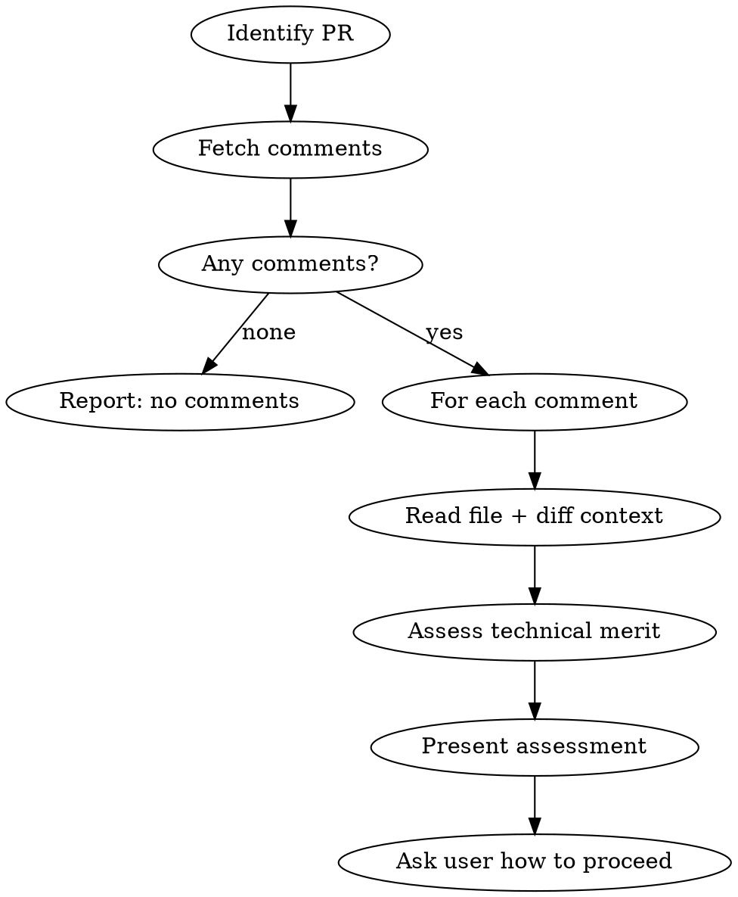

# Reviewing PR Feedback

## Overview

Fetch, contextualize, and assess review comments on a GitHub PR. Complements `superpowers:receiving-code-review` (process guidance) by automating the data-gathering and presenting a structured assessment.

**Core principle:** Gather all context before forming an opinion. Read the code, not just the comment.

## When to Use

- User asks to look at / examine / assess PR comments
- User shares a PR number and wants to understand feedback
- User asks "what does the reviewer want?" or similar
- Before implementing any review feedback (gather first, then act)

**When NOT to use:**
- Writing a NEW code review of a PR (use `code-review:code-review`)
- Implementing fixes after assessment is done (use `superpowers:receiving-code-review` for process)

## Workflow



### Step 1: Identify the PR

```bash
# If PR number given:
gh pr view {NUMBER} --json title,body,state,headRefName,baseRefName,url

# If no number given, detect from branch:
gh pr list --head $(git branch --show-current) --json number,title --jq '.[0]'
```

### Step 2: Fetch All Review Comments

Fetch both inline review comments and issue-level comments in parallel:

```bash
# Inline review comments (on specific lines)
gh api repos/{owner}/{repo}/pulls/{number}/comments \
  --jq '.[] | {id, user: .user.login, body, path, line, diff_hunk, created_at, in_reply_to_id}'

# Issue-level comments (general PR comments)
gh api repos/{owner}/{repo}/issues/{number}/comments \
  --jq '.[] | {id, user: .user.login, body, created_at}'
```

**Filter out:**
- Bot comments (coverage reports, CI status, auto-generated)
- Your own previous replies (check `in_reply_to_id` chains)

### Step 3: Read Context for Each Comment

For each human review comment:
1. **Read the file** at the commented line (with surrounding context)
2. **Read the PR diff** for that file to understand what changed
3. **Check if comment references** other files, configs, or patterns — read those too

### Step 4: Assess Each Comment

Apply `superpowers:receiving-code-review` principles. For each comment, determine:

| Assessment | Criteria |
|------------|----------|
| **Valid** | Reviewer is technically correct, fix needed |
| **Valid but different approach** | Problem is real, but a different solution is better |
| **Needs clarification** | Comment is ambiguous, need to ask before acting |
| **Disagree** | Reviewer is wrong or lacks context — push back with evidence |
| **Already addressed** | Fixed in a later commit or not applicable |

### Step 5: Present Structured Assessment

Format the assessment as:

```
## PR #{number} — Review Feedback Assessment

### Comment 1: {reviewer} on {file}:{line}
> {quoted comment}

**Assessment:** {Valid / Disagree / Needs clarification}
**Reasoning:** {Brief technical analysis with evidence from the code}
**Suggested action:** {What to do — fix, push back, ask}

### Comment 2: ...
```

### Step 6: Ask How to Proceed

After presenting the assessment, ask the user:
- Implement the fixes?
- Push back on specific comments?
- Ask the reviewer for clarification?
- Some combination?

## Replying to Comments on GitHub

When the user wants to reply to inline review comments, use the reply endpoint:

```bash
# Reply to an inline review comment (thread reply)
gh api repos/{owner}/{repo}/pulls/{number}/comments/{comment_id}/replies \
  -f body="Reply text here"

# Reply to an issue-level comment
gh api repos/{owner}/{repo}/issues/{number}/comments \
  -f body="Reply text here"
```

**Never** post a top-level issue comment when replying to an inline thread — use the thread reply endpoint.

## Common Mistakes

| Mistake | Fix |
|---------|-----|
| Reading only the comment, not the code | Always read file + diff before assessing |
| Agreeing without verifying | Check if the suggestion is actually correct for this codebase |
| Treating all comments as equal priority | Blocking issues first, then nitpicks |
| Replying to inline comment as top-level | Use the `/replies` endpoint for thread context |
| Implementing before full assessment | Gather ALL comments first — they may be related |
